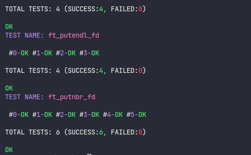

<div id="top"></div>

<!-- PROJECT LOGO -->
<br />
<div align="center">
  <h1 style="padding:16px;">Libft - 42 São Paulo</h1>
  <a href="https://github.com/brunobonaldi94">
	
  </a>
  <div>
  <p style="font-size:18px;">Score: <strong>125/100</strong> </p>
  </div>
</div>

<!-- TABLE OF CONTENTS -->
<details>
  <summary>Table of Contents</summary>
  <ol>
	<li>
	  <a href="#about-the-project">About The Project</a>
	</li>
	<li>
	  <a href="#how-to-run">How to run</a>
	</li>
	<li><a href="#how-to-test">How to test</a></li>
	<li><a href="#about_42">About 42</a></li>
  </ol>
</details>

<!-- ABOUT THE PROJECT -->
<div>
<h1 id="about-the-project" style="padding:16px 4px;
		border-top:0.5px solid rgba(255,255,255,0.20);">
		About The Project
</h1>
<h3  style="padding:0 8px;margin:16px 0">This project must follow some strict rule about format style, naming variables, forbidden functions etc. You want to see futher details, please check in the following link: <a href="https://github.com/42School/norminette">The Norm</a>
</h3>
<div style="padding:0 8px;">
	<h3 style="border-bottom:0.1px solid rgba(255,255,255,0.20);">Introduction</h3>
	<p>
		This is the first project at 42 SP school. It's required to create a static library recoding several standard functions in C (mainly functions defined in <i style="font-weight:bold">ctypes.h</i> and <i style="font-weight:bold">string.h</i> headers).
		A few future projects will allow to use this library.
		The project is divided in 3 parts: Part I, Part II and Bonus.
	</p>
</div>

<div style="padding:0 8px;">
	<h3 style="border-bottom:0.1px solid rgba(255,255,255,0.20);margin-bottom:16px;">Part I</h3>
	<p style="margin-bottom:16px">
		Part I is about some standard C funtions defined in <strong>ctypes.h</strong>, <strong>string.h</strong> and <strong>stdlib.h</strong> headers. It's composed of the following functions:
	</p>
	<table style="width: 100%">
	<thead>
	  <tr>
		<th style="text-align: center">Function Name</th>
		<th style="text-align: center">Short Description</th>
	  </tr>
	</thead>
	<tbody>
	  <tr>
		<td style="text-align: center">
		  <a href="ft_isalpha.c">ft_isalpha</a>
		</td>
		<td style="text-align: center">Check if a character is alphabetic.</td>
	  </tr>
	  <tr>
		<td style="text-align: center">
		  <a href="ft_isdigit.c">ft_isdigit</a>
		</td>
		<td style="text-align: center">Check if a character is a digit.</td>
	  </tr>
	  <tr>
		<td style="text-align: center">
		  <a href="ft_isalnum.c">ft_isalnum</a>
		</td>
		<td style="text-align: center">
		  Check if a character is isalphanumeric.
		</td>
	  </tr>
	  <tr>
		<td style="text-align: center">
		  <a href="ft_isascii.c">ft_isascii</a>
		</td>
		<td style="text-align: center">
		  Check if a character is a 7-bit unsigned char value that fits into the
		  ASCII character set.
		</td>
	  </tr>
	  <tr>
		<td style="text-align: center">
		  <a href="ft_isprint.c">ft_isprint</a>
		</td>
		<td style="text-align: center">
		  Check if a character is any printable character including space.
		</td>
	  </tr>
	  <tr>
		<td style="text-align: center">
		  <a href="ft_toupper.c">ft_toupper</a>
		</td>
		<td style="text-align: center">
		  Converts the character c to upper case, if possible.
		</td>
	  </tr>
	  <tr>
		<td style="text-align: center">
		  <a href="ft_tolower.c">ft_tolower</a>
		</td>
		<td style="text-align: center">
		  Converts the character c to lower case, if possible.
		</td>
	  </tr>
	  <tr>
		<td style="text-align: center">
		  <a href="ft_strlcpy.c">ft_strlcpy</a>
		</td>
		<td style="text-align: center">
		  Copies up to size - 1 characters from the NUL-terminated string to dst, NUL-terminating the result.
		</td>
	  </tr>
	  <tr>
		<td style="text-align: center">
		  <a href="ft_strlcat.c">ft_strlcat</a>
		</td>
		<td style="text-align: center">
		  Appends the NUL-terminated string src to the end of dst. It will append at most size - strlen(dst) - 1 bytes, NUL-terminating the result.
		</td>
	  </tr>
	  <tr>
		<td style="text-align: center">
		  <a href="ft_strlen.c">ft_strlen</a>
		</td>
		<td style="text-align: center">Calculate the length of a string</td>
	  </tr>
	  <tr>
		<td style="text-align: center">
		  <a href="ft_strchr.c">ft_strchr</a>
		</td>
		<td style="text-align: center">
		  Returns a pointer to the first occurrence of the character
		  <strong>c</strong> in the string <strong>s</strong>
		</td>
	  </tr>
	  <tr>
		<td style="text-align: center">
		  <a href="ft_strrchr.c">ft_strrchr</a>
		</td>
		<td style="text-align: center">
		  Returns a pointer to the last occurrence of the character
		  <strong>c</strong> in the string <strong>s</strong>
		</td>
	  </tr>
	  <tr>
		<td style="text-align: center">
		  <a href="ft_strncmp.c">ft_strncmp</a>
		</td>
		<td style="text-align: center">
		  Compares the two strings <strong>s1</strong> and <strong>s2</strong>. It returns an integer less than, equal to, or greater than zero if <strong>s1</strong> is found, respectively, to be less than, to match, or be greater than <strong>s2</strong>.
		</td>
	  </tr>
	  <tr>
		<td style="text-align: center">
		  <a href="ft_atoi.c">ft_atoi</a>
		</td>
		<td style="text-align: center">
		  converts the initial portion of the string pointed to by <strong>nptr</strong> to <strong>int</strong>.
		</td>
	  </tr>
	  <tr>
		<td style="text-align: center">
		  <a href="ft_strnstr.c">ft_strnstr</a>
		</td>
		<td style="text-align: center">
		  locates the first occurrence of the null-terminated string
		  <strong>s2</strong> in the string <strong>s1</strong>, where not more
		  than <strong>n</strong> characters are searched.
		</td>
	  </tr>
	  <tr>
		<td style="text-align: center">
		  <a href="ft_memset.c">ft_memset</a>
		</td>
		<td style="text-align: center">
		 fills the first <strong>n</strong> bytes of the memory area pointed to by <strong>s</strong> with the constant byte <strong>c</strong>.
		</td>
	  </tr>
	  <tr>
		<td style="text-align: center">
		  <a href="ft_bzero.c">ft_bzero</a>
		</td>
		<td style="text-align: center">
		  fills the first <strong>n</strong> bytes of the memory area pointed to by <strong>s</strong> with zero <strong>()'\0'</strong>.
		</td>
	  </tr>
	  <tr>
		<td style="text-align: center">
		  <a href="ft_memcpy.c">ft_memcpy</a>
		</td>
		<td style="text-align: center">
		 copies <strong>n</strong> bytes from memory area <strong>src</strong> to memory area <strong>dest</strong>. The memory areas must not overlap.
		</td>
	  </tr>
	  <tr>
		<td style="text-align: center">
		  <a href="ft_memmove.c">ft_memmove</a>
		</td>
		<td style="text-align: center">
		 copies <strong>n</strong> bytes from memory area <strong>src</strong> to memory area <strong>dest</strong>. The memory may overlap.
		</td>
	  </tr>
	  <tr>
		<td style="text-align: center">
		  <a href="ft_memchr.c">ft_memchr</a>
		</td>
		<td style="text-align: center">
		  scans the initial <strong>n</strong> bytes of the memory area pointed to by <strong>s</strong> for the first instance of <strong>c</strong>
		</td>
	  </tr>
	  <tr>
		<td style="text-align: center">
		  <a href="ft_memcmp.c">ft_memcmp</a>
		</td>
		<td style="text-align: center">
		 compares the first <strong>n</strong> bytes (each interpreted as unsigned char) of the memory areas <strong>s1</strong> and <strong>s2</strong>.
		</td>
	  </tr>
	  <tr>
		<td style="text-align: center">
		  <a href="ft_calloc.c">ft_calloc</a>
		</td>
		<td style="text-align: center">
		  allocates memory for an array of <strong>nmemb</strong> elements of <strong>size</strong> bytes each and returns a pointer to the allocated memory. The memory is set to zero.
		</td>
	  </tr>
	  <tr>
		<td style="text-align: center">
		  <a href="ft_strdup.c">ft_strdup</a>
		</td>
		<td style="text-align: center">
		  returns a pointer to a new string which is a duplicate of the string <strong>s</strong>
		</td>
	  </tr>
	</tbody>
  </table>
</div>

<div style="padding:0 8px;">
	<h3 style="border-bottom:0.1px solid rgba(255,255,255,0.20);margin-bottom:16px">Part II</h3>
	<p style="margin-bottom:16px">
		Part II is required to develop a set of functions that are either not in the <i>libc</i>,or that are part of it but in a different form. It's composed of the following functions:
	</p>
	<table style="width: 100%">
	<thead>
	  <tr>
		<th style="text-align: center">Function Name</th>
		<th style="text-align: center">Short Description</th>
	  </tr>
	</thead>
	<tbody>
	  <tr>
		<td style="text-align: center">
		  <a href="ft_substr.c">ft_substr</a>
		</td>
		<td style="text-align: center">Allocates (with malloc(3)) and returns a substring from the string <strong>s</strong>.The substring begins at index <strong>start</strong> and is of maximum size <strong>len</strong>.</td>
	  </tr>
	  <tr>
		<td style="text-align: center">
		  <a href="ft_strjoin.c">ft_strjoin</a>
		</td>
		<td style="text-align: center">Allocates (with malloc(3)) and returns a new string, which is the result of the concatenation of <strong>s1</strong> and <strong>s2</strong>.</td>
	  </tr>
	  <tr>
		<td style="text-align: center">
		  <a href="ft_strtrim.c">ft_strtrim</a>
		</td>
		<td style="text-align: center">
		  Allocates (with malloc(3)) and returns a copy of <strong>s1</strong> with the characters specified in <strong>set</strong> removed from the beginning and the end of the string.
		</td>
	  </tr>
	  <tr>
		<td style="text-align: center">
		  <a href="ft_split.c">ft_split</a>
		</td>
		<td style="text-align: center">
		  Allocates (with malloc(3)) and returns an array of strings obtained by splitting <strong>s</strong> using the character <strong>c</strong> as a delimiter. The array must end with a NULL pointer.
		</td>
	  </tr>
	  <tr>
		<td style="text-align: center">
		  <a href="ft_itoa.c">ft_itoa</a>
		</td>
		<td style="text-align: center">
		 Allocates (with malloc(3)) and returns a string representing the integer received as an argument.Negative numbers must be handled.
		</td>
	  </tr>
	  <tr>
		<td style="text-align: center">
		  <a href="ft_strmapi.c">ft_strmapi</a>
		</td>
		<td style="text-align: center">
		  Applies the function <strong>f</strong> to each character of the string <strong>s</strong>, and passing its index as first argument to create a new string (with malloc(3)) resulting from successive applications of <strong>f</strong>.
		</td>
	  </tr>
	  <tr>
		<td style="text-align: center">
		  <a href="ft_striteri.c">ft_striteri</a>
		</td>
		<td style="text-align: center">
		  Applies the function <strong>f</strong> on each character of the string passed as argument, passing its index as first argument. Each character is passed by address to <strong>f</strong> to be modified if necessary.
		</td>
	  </tr>
	  <tr>
		<td style="text-align: center">
		  <a href="ft_putchar_fd.c">ft_putchar_fd</a>
		</td>
		<td style="text-align: center">
		 Outputs the character <strong>c</strong> to the given file descriptor.
		</td>
	  </tr>
	  <tr>
		<td style="text-align: center">
		  <a href="ft_putstr_fd.c">ft_putstr_fd</a>
		</td>
		<td style="text-align: center">
		 Outputs the string <strong>s</strong> to the given file descriptor.
		</td>
	  </tr>
	  <tr>
		<td style="text-align: center">
		  <a href="ft_putendl_fd.c">ft_putendl_fd</a>
		</td>
		<td style="text-align: center">Outputs the string <strong>s</strong> to the given file descriptor followed by a newline.</td>
	  </tr>
	  <tr>
		<td style="text-align: center">
		  <a href="ft_putnbr_fd.c">ft_putnbr_fd</a>
		</td>
		<td style="text-align: center">
		 Outputs the integer <strong>n</strong> to the given file descriptor.
		</td>
	  </tr>
	</tbody>
  </table>
</div>
<div style="padding:0 8px;">
	<h3 style="border-bottom:0.1px solid rgba(255,255,255,0.20);margin-bottom:16px">Bonus</h3>
	<p style="margin-bottom:16px">
		In Bonus section, you are introduced to the concept of Linked Lists. How to implement and do some basics operation on them (add node, remove node, calculate length, etc). It's composed of the following functions:
	</p>
	<p>The node must be implemented using the following format:</p>

```c
typedef struct s_list
{
	void *content;
	struct s_list *next;
}	t_list;
```
<table style="width: 100%">
	<thead>
	  <tr>
		<th style="text-align: center">Function Name</th>
		<th style="text-align: center">Short Description</th>
	  </tr>
	</thead>
	<tbody>
	  <tr>
		<td style="text-align: center">
		  <a href="ft_lstnew.c">ft_lstnew</a>
		</td>
		<td style="text-align: center">Allocates (with malloc(3)) and returns a new node. The member variable <strong>content</strong> is initialized with the value of the parameter <strong>content</strong>. The variable <strong>next</strong> is initialized to NULL.</td>
	  </tr>
	  <tr>
		<td style="text-align: center">
		  <a href="ft_lstadd_front.c">ft_lstadd_front</a>
		</td>
		<td style="text-align: center">Adds the node <strong>new</strong> at the beginning of the list.</td>
	  </tr>
	  <tr>
		<td style="text-align: center">
		  <a href="ft_lstsize.c">ft_lstsize</a>
		</td>
		<td style="text-align: center">
		 Counts the number of nodes in a list.
		</td>
	  </tr>
	  <tr>
		<td style="text-align: center">
		  <a href="ft_lstlast.c">ft_lstlast</a>
		</td>
		<td style="text-align: center">
			Returns the last node of the list.
		</td>
	  </tr>
	  <tr>
		<td style="text-align: center">
		  <a href="ft_lstadd_back.c">ft_lstadd_back</a>
		</td>
		<td style="text-align: center">
			Adds the node <strong>new</strong> at the end of the list.
		</td>
	  </tr>
	  <tr>
		<td style="text-align: center">
		  <a href="ft_lstdelone.c">ft_lstdelone</a>
		</td>
		<td style="text-align: center">
			Takes as a parameter a node and frees the memory of
			the node's content using the function <strong>del</strong> given
			as a parameter and free the node. The memory of
			<strong>next</strong> must not be freed.
		</td>
	  </tr>
	  <tr>
		<td style="text-align: center">
		  <a href="ft_lstclear.c">ft_lstclear</a>
		</td>
		<td style="text-align: center">
			Deletes and frees the given node and every successor of that node, using the function <strong>del</strong> and free(3). Finally, the pointer to the list must be set to NULL.
		</td>
	  </tr>
	  <tr>
		<td style="text-align: center">
		  <a href="ft_lstiter.c">ft_lstiter</a>
		</td>
		<td style="text-align: center">
		 Iterates the list <strong>lst</strong> and applies the function <strong>f</strong> on the content of each node.
		</td>
	  </tr>
	  <tr>
		<td style="text-align: center">
		  <a href="ft_lstmap.c">ft_lstmap</a>
		</td>
		<td style="text-align: center">
		 Iterates the list <strong>lst</strong> and applies the function <strong>f</strong> on the content of each node. Creates a new list resulting of the successive applications of the function <strong>f</strong>. The <strong>del</strong> function is used to delete the content of a node if needed.
		</td>
	  </tr>
	</tbody>
  </table>
</div>

</div>


<p align="right">(<a href="#top">back to top</a>)</p>


<h1 id="how-to-rin" style="padding:16px 4px;
		border-top:0.5px solid rgba(255,255,255,0.20);">How to run</h1>

<p style="padding:0 8px;">
	There is a <strong>Makefile</strong> at the root of the project to create the static library called <strong>libft.a</strong>. You can run the project by typing:
</p>

```Makefile
#to run only mandatory functions
make all
#to run the mandatory and bonus functions
make bonus
```
<p>This will create the <strong>libft.a</strong> static library that you test the functions in a C file like this:</p>

1. Include libft.h header in your file
```c
//test.c
#include "libft.h"
```
2. Add the function you would like to test in a C file (exampe:test.c)
```c
//test.c 
char *str = "Hello World!";
char **split = ft_split(str, ' ');
```
3. Compile and run the program
```Makefile
gcc -Wall -Wextra -Werror -o test test.c libft.a
./test && rm -f test
```
<h1 id="how-to-test" style="border-bottom:1px solid gray;margin-bottom:16px;">How to test</h1>
<p>I also created my own tests to compare the function results with the expected outcome.</p>

1. There is a folder called <strong>tests</strong> at the root of the project. Just go to the folder and run the following command:
```shell
cd test
```
2. Use the make command</p>
```Makefile
#to run only mandatory functions
make all
#to run bonus functions
make bonus
```
3. You will able to see the tests results in the terminal.




4. You can check some of the functions output and comparison with the expected outcome in a file in the <strong>tests/test_results</strong> folder.

<p align="right">(<a href="#top">back to top</a>)</p>

 
<h1 id="about_42" style="width:100%;
		border-top:0.5px solid rgba(255,255,255,0.20);
		padding:16px 0;">About 42</h1>
<div style="width:100%;
		display:flex;
		flex-direction:column;
		align-items:center;
		justify-content:center;">
	
</div>
<p style="padding:0 8px;">
42 is a future-proof computer science training to educate the next generation of software engineers. The 42 program takes a project-based approach to progress and is designed to develop technical and people skills that match the expectations of the labor market.
</p>
<p style="padding:0 8px;">
To join 42, you must pass in a selection process called "Piscine"or "Basecamp".
</p>
<p style="padding:0 8px;">42 São Paulo is part of 42 School network, for more information please access this link below:
<h3  style="font-size:24px;padding:0 8px;"><a href="https://www.42sp.org.br/">
42-São Paulo
</a></h3></p>

<p align="right">(<a href="#top">back to top</a>)</p>